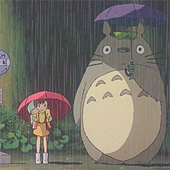

<h1 align="center">╭──╯ 𝗪𝗲𝗹𝗰𝗼𝗺𝗲 𝘁𝗼 𝗺𝘆 𝗽𝗿𝗼𝗳𝗶𝗹𝗲 ╰──╮</h1><br/>
<br/>

<div align="center">
  
[](https://spotify-github-profile.kittinanx.com/api/view?uid=2sqedz98t0t3e2vtbvo2646vs&redirect=true)

<div align="center">
  <a href="https://open.spotify.com/user/kdmapper.exe">
    
  </a>
</div>

</div><br/>

# 💫 About Me
```C++
#include <iostream>

int main() {
      std::cout << "Hi y'all, Im from indonesia and i like make simpel project :D \n";
      std::cout << "Hope u guys like my project UwU \n";
}
```

```py
print("I am currently studying Python")
```
---
# 💻 Tech Stack
**Language** <div align="left"> 
  
  
  
  
  
  
  
  
  </div> <br/>
**Sofware Coding** <div align="left"> 
  
  
  
</div> <br/>

---
# 📊 GitHub Stats
<br/>
<br/>


---
### 🔝 Top Contributed Repo


---
[](https://visitcount.itsvg.in)
<br/>

